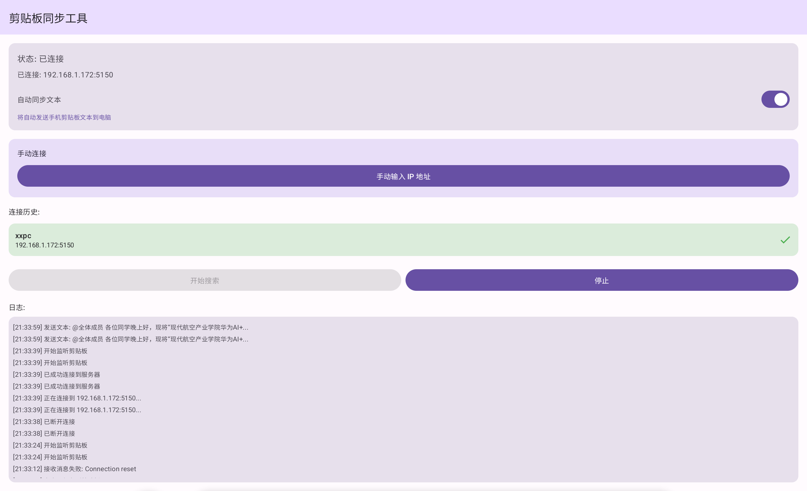

# 📋 ClipboardSync - 跨设备剪贴板同步工具

一个简单高效的剪贴板同步解决方案，支持在 Windows 和 Android 设备之间同步文本和图片。

## 📸 界面预览



## ✨ 功能特性

- 🖼️ **图片同步**: 支持截图自动同步到 Android 剪贴板
- 📝 **文本同步**: 支持文本内容跨设备复制粘贴
- 🔍 **自动发现**: Android 端通过 UDP 广播自动发现 Windows 设备
- 🔐 **局域网传输**: 所有数据在局域网内传输，保护隐私安全
- 🎨 **现代化界面**: Windows 端采用清爽的 GUI，Android 端使用 Material Design 3
- 📱 **系统托盘**: Windows 端支持最小化到系统托盘运行
- 💾 **连接历史**: Android 端记忆最近连接的设备

## 📦 项目结构

```
clickboard_sync/
├── ClipboardSync.Python/     # Windows 端 (Python 实现)
│   ├── clipboard_sync.py     # 主程序
│   ├── requirements.txt      # Python 依赖
│   ├── 启动.bat              # 快速启动脚本
│   └── README.md            # Python 端说明
├── ClipboardSync.Android/     # Android 端 (Kotlin + Jetpack Compose)
│   └── app/                  # Android 应用源码
└── README.md                # 项目总览 (本文件)
```

## 🚀 快速开始

### Windows 端安装

#### 方法一: 使用批处理文件 (推荐)

1. 进入 `ClipboardSync.Python` 目录
2. 双击运行 `启动.bat`
3. 程序会自动检查并安装依赖
4. 启动后点击"启动服务"按钮

#### 方法二: 手动安装

```powershell
# 1. 安装依赖
cd ClipboardSync.Python
pip install -r requirements.txt

# 2. 运行程序
python clipboard_sync.py
```

**依赖要求:**
- Python 3.8 或更高版本
- Pillow (图片处理)
- pywin32 (Windows 剪贴板访问)
- pystray (系统托盘支持)

### Android 端安装

#### 方法一: 使用 Android Studio

1. 用 Android Studio 打开 `ClipboardSync.Android` 目录
2. 等待 Gradle 同步完成
3. 连接 Android 设备或启动模拟器
4. 点击 Run 按钮安装

#### 方法二: 使用 Gradle 命令行

```bash
cd ClipboardSync.Android
# 构建 APK
./gradlew assembleDebug
# 安装到设备
./gradlew installDebug
```

**系统要求:**
- Android 8.0 (API 26) 或更高版本
- 需要网络和剪贴板权限

## 📱 使用说明

### 第一次使用

1. **启动 Windows 端**
   - 运行 `clipboard_sync.py` 或使用 `启动.bat`
   - 点击界面上的"启动服务"按钮
   - 确保防火墙允许程序通过 (首次运行会提示)

2. **启动 Android 端**
   - 打开 ClipboardSync APP
   - APP 会自动搜索局域网内的 Windows 设备
   - 从发现的设备列表中选择你的 Windows 设备
   - 或者手动输入 Windows 设备的 IP 地址

3. **开始同步**
   - Windows 端: 使用 `Win + Shift + S` 截图，图片会自动同步到 Android
   - Android 端: 复制文本或图片，会自动发送到 Windows 剪贴板

### 日常使用

- Windows 端可以最小化到系统托盘后台运行
- Android 端会记住最近连接的设备，下次打开可快速连接
- 两端需要在同一 WiFi 网络下

## 🔧 技术细节

### 通信协议

- **UDP 广播端口**: 5149 (用于设备发现)
- **TCP 服务端口**: 5150-5169 (用于数据传输)
- **消息格式**: JSON
- **图片编码**: Base64

### 消息类型

```json
{
  "type": "image",        // 或 "text"
  "data": "base64..."     // 图片的 Base64 编码或文本内容
}
```

### Windows 端技术栈

- **Python 3.8+**
- **Tkinter**: GUI 界面
- **Pillow**: 图片处理
- **pywin32**: Windows API 访问
- **pystray**: 系统托盘图标
- **Socket**: TCP/UDP 网络通信

### Android 端技术栈

- **Kotlin 1.9+**
- **Jetpack Compose**: 现代化 UI 框架
- **Material Design 3**: UI 设计规范
- **Kotlin Coroutines**: 异步处理
- **Kotlin Serialization**: JSON 序列化

## ⚠️ 注意事项

1. **网络环境**
   - 确保 Windows 和 Android 设备在同一局域网 (WiFi)
   - 部分公共 WiFi 可能限制设备间通信

2. **防火墙设置**
   - Windows 首次运行时需要允许程序通过防火墙
   - 如果连接失败，检查防火墙是否阻止了 5149 和 5150-5169 端口

3. **权限要求**
   - Android 端需要网络权限和剪贴板访问权限
   - Windows 端需要剪贴板访问权限

4. **数据安全**
   - 所有数据仅在局域网内传输
   - 不会上传到任何服务器
   - 建议仅在可信网络环境下使用

## 🐛 常见问题

### Q: Android 端找不到 Windows 设备？

A: 请检查:
- 两个设备是否在同一 WiFi 网络
- Windows 端是否已启动服务
- Windows 防火墙是否允许程序通过
- 尝试手动输入 Windows 设备的 IP 地址

### Q: 图片同步失败？

A: 可能原因:
- 图片过大 (建议小于 10MB)
- 网络连接不稳定
- 检查 Windows 端日志查看错误信息

### Q: 如何查看 Windows 设备的 IP 地址？

A: 
```powershell
# 在 PowerShell 中运行
ipconfig | findstr IPv4
```

### Q: 如何让 Windows 端开机自启？

A: 
1. 按 `Win + R` 打开运行
2. 输入 `shell:startup` 并回车
3. 创建 `启动.bat` 的快捷方式到该文件夹

## 📝 开发计划

- [ ] 支持文件传输
- [ ] 支持多台设备同时连接
- [ ] 添加加密传输选项
- [ ] macOS 端支持
- [ ] iOS 端支持
- [ ] 剪贴板历史记录
- [ ] 云端同步选项

## 📄 许可证

本项目采用 MIT 许可证

## 🤝 贡献

欢迎提交 Issue 和 Pull Request！

## 📧 联系方式

如有问题或建议，请通过以下方式联系:
- GitHub Issues: [创建 Issue](https://github.com/flycalm/clickboard_sync/issues)

---

⭐ 如果这个项目对你有帮助，请给一个 Star！
